# Virtual Learning Platform

Virtual Learning is a Flutter-based Android educational platform that gives students access to virtual microscopy experiences and interactive learning resources without requiring physical laboratory equipment. (DEMO VIDEO LINK: https://drive.google.com/file/d/1vc-PoUynUI_BybOGOOI6m9RO0vBn6V1r/view?usp=drivesdk)

The project addresses challenges faced by schools and learners in environments where access to laboratories, microscopes, reliable internet connectivity, and educational resources may be limited. It also supports instructor and student communication through an admin-to-student messaging and response system.

## Project Overview

The platform combines mobile learning, virtual microscopy, and cloud-based content management into a single educational application. Students can examine digital microscope slides, interact with annotated regions and educational hotspots, complete quizzes, take notes, download learning materials for offline use, and communicate with instructors.

Administrators and tutors can upload and organize microscope slides, create annotations and hotspots, manage quizzes, maintain educational content, monitor learning progress, and prepare the platform for future AI-assisted learning features.

## Problem Statement

Many schools face challenges in providing practical science education due to:

- Limited laboratory equipment
- High costs of microscopes and specimen preparation
- Difficulty assembling students in a laboratory, especially for MOOCs and online schools
- Limited access to educational resources
- Geographic constraints
- Internet connectivity issues

This project provides a digital alternative that allows students to perform virtual observations and learning activities using a mobile device. The ubiquity of mobile devices and the application's low internet requirement make practical digital learning more accessible and affordable.

## Target Audience

- High school students
- Independent candidates preparing for external examinations
- Distance-learning students who need alternatives to physical practical sessions
- University students in biological sciences, histology, anatomy and physiology, botany, and environmental science

## Project Objectives

- Provide access to virtual microscopy experiences
- Improve science education accessibility
- Support offline learning
- Enhance student engagement
- Create interactive learning experiences
- Reduce dependence on physical laboratory resources

## Core Capabilities

### Students Can

- Access digital microscope slides
- Zoom and inspect biological specimens
- Download slides for offline viewing
- View hotspot explanations
- Study at their own time and pace
- Study annotated regions of interest
- Take specimen-related quizzes
- Create, edit, and delete study notes
- Communicate with instructors
- Potentially interact with AI-assisted learning tools in future versions

### Administrators and Tutors Can

- Upload and manage digital microscope slides
- Organize slides into biological categories and topics
- Create, edit, and manage interactive hotspots
- Annotate regions of interest on microscope slides
- Create, update, and manage quizzes associated with individual specimens
- Monitor student learning progress and quiz performance
- Update and maintain educational content in real time
- Manage user accounts and access to platform resources
- Provide structured materials that support self-paced study
- Integrate and manage AI-assisted learning features in future versions

## Glossary

| Term | Definition |
| --- | --- |
| Annotation | A digital note, label, or graphical marker, such as a rectangle or polygon, placed on a microscope slide to identify or explain a region of interest. |
| Authentication | The process of verifying a user's identity before granting access to the application using secure login credentials. |
| Cloud Firestore | Google's NoSQL cloud database used to store application data such as users, microscope slides, annotations, hotspots, quizzes, and progress records. |
| Cloud Storage | Online storage services used to securely store digital microscope images and other educational resources for remote access. |
| Digital Microscope Slide | A high-resolution image of a biological specimen that can be viewed and manipulated electronically instead of using a physical microscope. |
| Firebase | Google's Backend-as-a-Service platform that provides authentication, databases, cloud storage, and hosting for the application. |
| Hotspot | An interactive point placed on a microscope slide that displays additional information when selected by a learner. |
| Microscope Slide | A prepared specimen mounted for microscopic examination. In this system, it refers to its digitized version. |
| NoSQL Database | A non-relational database designed to store flexible, document-based data structures, such as Cloud Firestore. |
| Offline Viewing | A feature that allows downloaded microscope slides to be accessed without an internet connection. |
| Panning and Zooming | The process of moving across and magnifying a digital microscope image to observe finer specimen details. |
| Polygon Annotation | A multi-sided graphical shape used to accurately outline irregular regions of interest on a microscope slide. |
| Quiz | A set of assessment questions designed to evaluate students' understanding of a microscope specimen or related topic. |
| Slide Library | The collection of digital microscope slides available within the application for study. |
| Student | The primary end user who accesses slides, explores annotations, views hotspots, completes quizzes, and tracks learning progress. |
| Tutor/Admin | An educator responsible for uploading microscope slides, creating annotations and hotspots, designing quizzes, and monitoring student learning. |
| Virtual Laboratory | A digital environment that simulates laboratory activities, allowing students to study specimens without physical laboratory equipment. |
| Virtual Microscope | Software that simulates the functions of a traditional microscope, allowing users to zoom, pan, inspect, and interact with digital microscope slides. |

## Features Implemented

### Authentication Module

The Authentication Module is the gateway to the Virtual Learning platform. It provides secure registration, login, password recovery, and role-based access control using Firebase Authentication.

Students can register and access protected learning resources, while administrators and tutors receive additional privileges for content management, annotation creation, quiz management, and student performance monitoring.

<p align="center">
  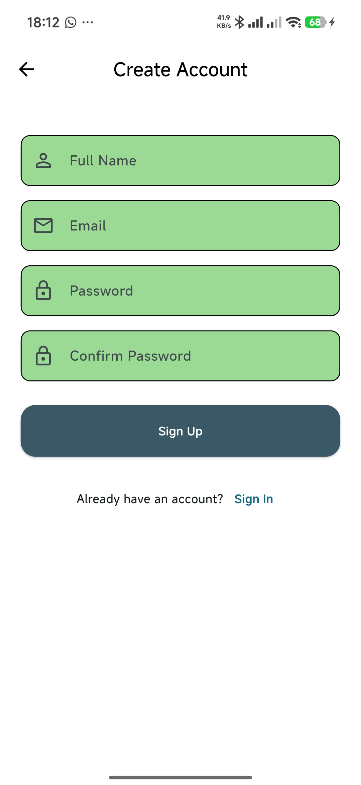
  <br>
  <em>Sign up screen</em>
</p>

<p align="center">
  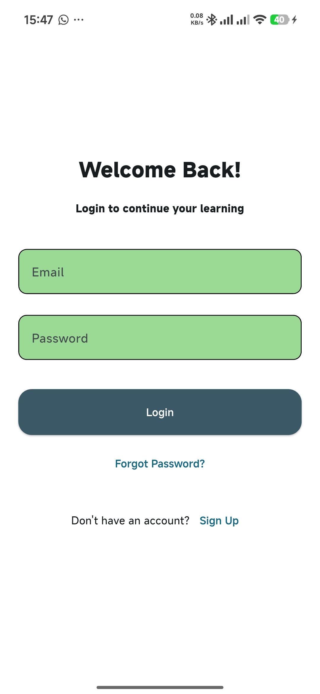
  <br>
  <em>Login screen</em>
</p>

#### Student Registration

Students can:

- Create new accounts
- Validate user input
- Register using email and password

#### Student Login

Students can:

- Sign in securely
- Access protected content

#### Password Recovery

Students can:

- Request password reset emails
- Recover forgotten accounts

### Dashboard

The Dashboard is the main entry point after login. It provides a centralized interface for accessing the platform's major learning features, including the Slide Library, Virtual Microscope, Quizzes, Notes, Downloaded Slides, profile information, instructor messages, and bulletins.

New students can only access the microscope after viewing a slide from the Slide Library. Similarly, quiz access is tied to previously viewed slides. The Recent Topic panel helps users return quickly to previously viewed slides and track their progress.

<p align="center">
  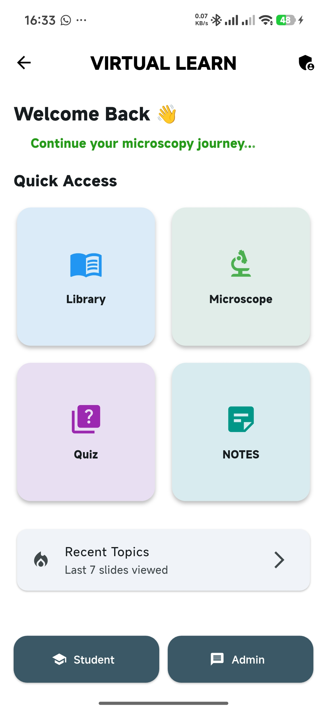
  <br>
  <em>Dashboard</em>
</p>

<p align="center">
  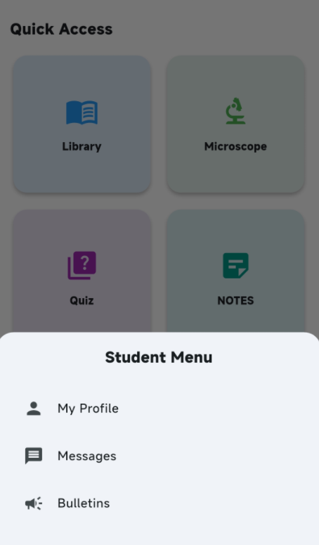
  <br>
  <em>Student menu</em>
</p>

The Profile screen displays student biodata and overall performance across slide views and quizzes using a progress indicator. The Messages screen allows students to read replies from administrators and tutors. Bulletins display general announcements from administrators.

### Student Workflow

```text
Launch App
   ↓
Login / Register
   ↓
Dashboard
   ↓
Select Slide
   ↓
Open Microscope
   ↓
Zoom & Explore
   ↓
View Hotspots
   ↓
Read Annotations
   ↓
Take Quiz
   ↓
Review Learning
   ↓
Ask Instructor
```

Students may ask instructors for help while exploring hotspots, taking quizzes, or reviewing learning materials.

### Virtual Microscope

The Virtual Microscope module is the core component of the platform. It provides a digital environment that simulates the experience of using a physical microscope by allowing students to examine high-resolution images of biological specimens.

The module supports:

- High-resolution slide viewing
- Zoom controls
- Pan controls
- Interactive slide navigation
- Hotspot and annotation overlays

<p align="center">
  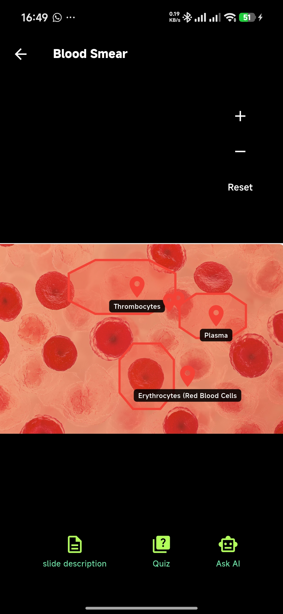
  <br>
  <em>Microscope screen</em>
</p>

### Slide Library

The Slide Library is the primary repository of digital microscope specimens. It provides organized access to high-resolution slides and includes search functionality for quick specimen retrieval.

Students can use the Slide Library to:

- Browse microscope slides
- Search for specimens
- Launch slides in the Virtual Microscope
- Access related hotspots, annotations, and quizzes
- Download slides for offline viewing

<p align="center">
  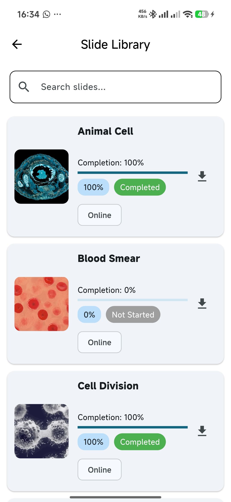
  <br>
  <em>Slide Library</em>
</p>

### Hotspot System

The Hotspot System enables educators to highlight significant regions within digital microscope slides. Each hotspot contains educational content such as a title, description, and supporting notes.

Students can tap hotspots while viewing a slide to reveal contextual explanations. This combines visual exploration with guided learning and helps students identify important biological structures.

<p align="center">
  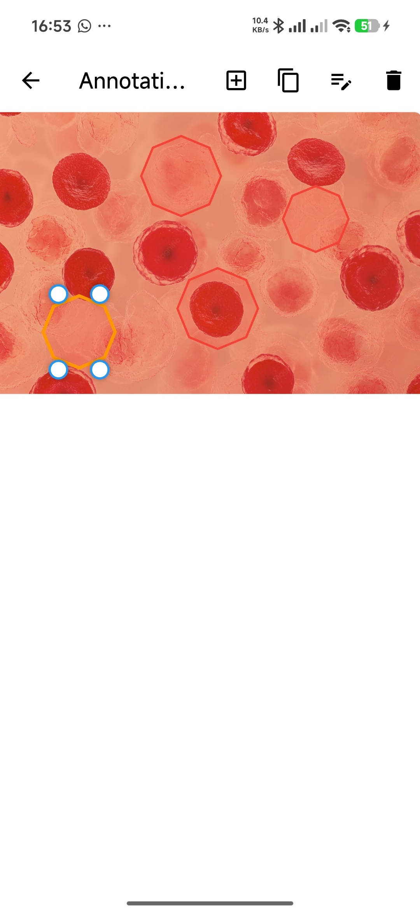
  <br>
  <em>Slide showing hotspots</em>
</p>

### Annotation System

The Annotation System enables educators to mark and describe regions of interest on digital microscope slides. It supports creating, editing, duplicating, repositioning, resizing, and deleting annotations.

Each annotation can store:

- Title
- Description
- Notes
- Custom color
- Shape information

Annotations are synchronized with Cloud Firestore, allowing students to view highlighted specimen regions and educational information in real time. The annotation designer supports real-time loading, selection, resizing, duplication, deletion, and detail updates for saved annotation shapes.

<p align="center">
  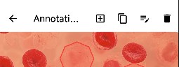
  <br>
  <em>Annotation controls</em>
</p>

### Quiz System

The Quiz System provides specimen-related assessments that allow students to evaluate their understanding after examining microscope slides. Students can launch quizzes, answer multiple-choice questions, and receive feedback on their performance.

Quiz content is retrieved from Cloud Firestore using the following structure:

```text
quizzes/{slideId}/questions/{questionId}
```

Each question stores:

- Question text
- Answer options
- Correct answer index

This cloud-based approach allows tutors to update assessment content without requiring application updates.

<p align="center">
  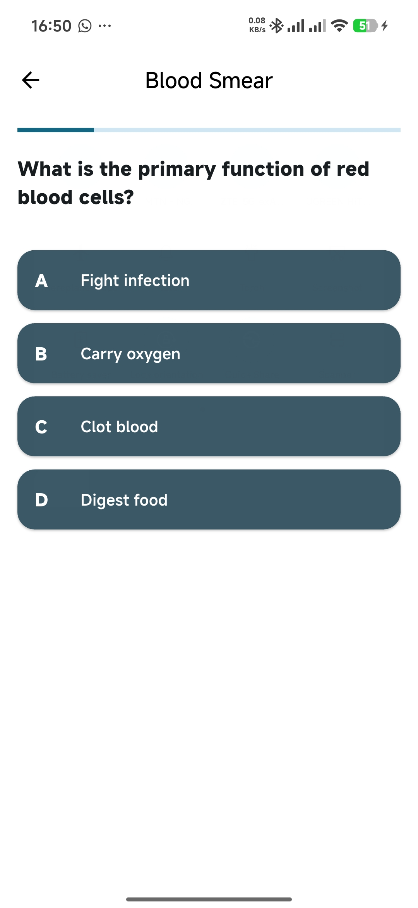
  <br>
  <em>Quiz screen</em>
</p>

### Notes System

The Notes module enables students to record, organize, and manage personal study notes. Notes can be created from the dashboard, edited, deleted, automatically timestamped, and associated with a slide topic or custom topic.

Notes are stored locally per user using SharedPreferences, allowing students to review and modify them without an active internet connection.

<p align="center">
  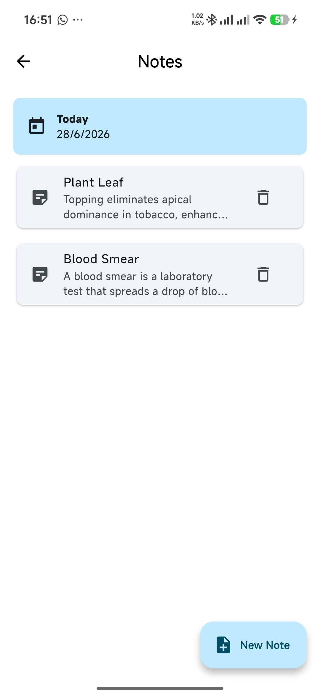
  <br>
  <em>Notes screen</em>
</p>

### Offline Learning Support

The Offline Learning Support feature allows students to continue studying when internet connectivity is limited or unavailable. Students can download microscope slides to their devices and access them locally without a continuous network connection.

<p align="center">
  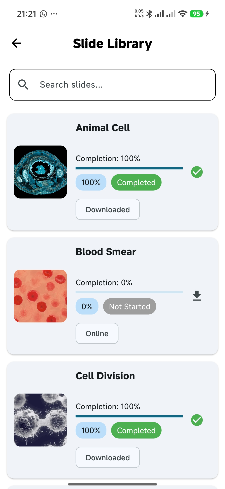
  <br>
  <em>Slide Library showing a downloaded slide</em>
</p>

### Admin Section

The Admin Section provides a centralized management interface for administrators and tutors. Authorized users can upload microscope slides, manage specimen information, create hotspots and annotations, develop quizzes, oversee educational content, and monitor learning progress.

<p align="center">
  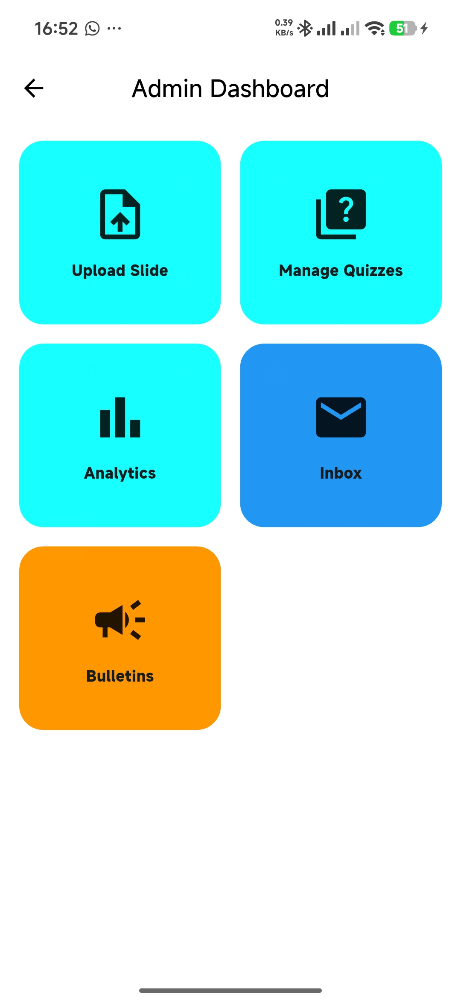
  <br>
  <em>Admin dashboard</em>
</p>

#### Administrator Workflow

```text
Login
   ↓
Manage Slides
   ↓
Create Hotspots
   ↓
Create Annotations
   ↓
Create Polygon Regions
   ↓
Publish Learning Content
```

<p align="center">
  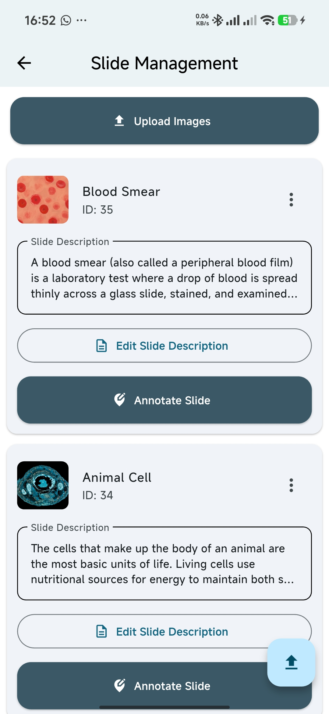
  <br>
  <em>Slide management screen</em>
</p>

<p align="center">
  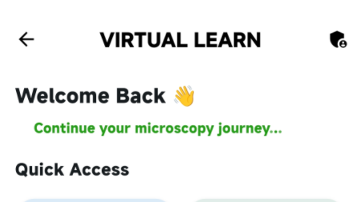
  <br>
  <em>Admin entry point on the home screen</em>
</p>

Technically, the Admin Section is implemented with Flutter and Firebase. Firebase Authentication verifies administrator credentials and restricts privileged operations. Cloud Firestore stores structured data such as slide metadata, hotspot information, polygon and shape annotations, quiz content, and student progress records.

High-resolution microscope images are hosted on Cloudinary, with image URLs stored in Firestore for optimized storage and delivery. Firestore streams provide real-time synchronization, so updates made by administrators become available to students without requiring software updates.

The module implements standard CRUD operations for learning resources. Administrators can upload slides, edit specimen details, reposition and modify annotations, manage hotspots, create and update quiz questions, and remove outdated materials.

## AI Tutor Integration

AI tutoring remains a planned enhancement for future versions. The former dashboard AI shortcut is currently used for the student Notes notebook.

## Technical Implementation

### Architecture

The application follows a feature-based modular architecture:

```text
lib/
├── core/
├── data/
├── features/
│   ├── auth/
│   ├── admin/
│   ├── microscope/
│   ├── message/
│   ├── screens/
│   ├── quiz/
│   └── ai/ (future addition)
└── widgets/
```

Core functionalities are grouped under dedicated modules such as authentication, administration, microscope, messaging, quiz, notes, downloads, and screens. Shared utilities, data models, repositories, and reusable widgets are maintained in separate directories.

The `core` directory contains shared services, utilities, constants, helper classes, themes, and routes. The `data` directory contains models and repositories responsible for Firebase services and local storage. The `features` directory contains the major functional modules, allowing each feature to maintain its own screens, controllers, widgets, and business logic. The `widgets` directory stores reusable UI components.

This organization improves maintainability, scalability, code clarity, and UI consistency.

### Backend Services

The platform uses Firebase and Cloudinary as its primary backend services.

Firebase provides:

- Authentication
- Cloud Firestore data storage
- Real-time synchronization
- User and role management support

Cloudinary provides:

- High-resolution microscope image storage
- Optimized image delivery
- Media hosting for digital slides

### Firebase Authentication

Firebase Authentication manages user identity and access through secure registration, login, and password recovery. It supports role-based access for students and administrators.

### Cloud Firestore

Cloud Firestore is the primary NoSQL cloud database. It stores and synchronizes:

- Slide metadata
- Hotspots
- Annotations
- Quiz content
- Student profile information
- Learning progress summaries
- Messages and bulletins

<p align="center">
  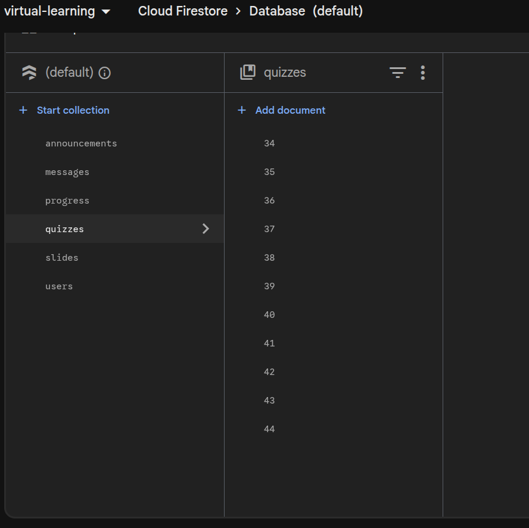
  <br>
  <em>Firebase NoSQL collections</em>
</p>

### Data Storage

The application uses both cloud and local storage to support online and offline learning.

#### Cloud Storage

Cloud storage maintains shared educational resources and media assets, including slide information, annotation records, educational content, and microscope images hosted on Cloudinary.

#### Local Storage

Local storage supports offline learning by preserving essential data on the user's device, including:

- Downloaded slides
- Cached educational resources
- Student notes
- Last viewed slide history
- Local quiz progress cache

## Module Summary

### Authentication Module

The Authentication Module verifies user identities and controls access to the application. It supports registration, login, password recovery, input validation, and secure sessions through Firebase Authentication.

<p align="center">
  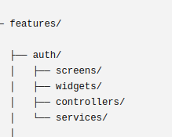
  <br>
  <em>Authentication module skeleton</em>
</p>

### Dashboard Module

The Dashboard Module provides quick access to the Slide Library, Virtual Microscope, Quizzes, Notes, Downloaded Slides, profile pages, messages, and bulletins.

<p align="center">
  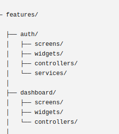
  <br>
  <em>Dashboard module skeleton</em>
</p>

### Slide Library Module

The Slide Library Module presents high-resolution biological slides in an organized, searchable interface. Students can open slides in the Virtual Microscope, access hotspots and annotations, launch quizzes, or download slides for offline use.

### Virtual Microscope Module

The Virtual Microscope Module allows students to zoom, pan, and inspect digital microscope slides while interacting with educational overlays such as hotspots and annotations.

<p align="center">
  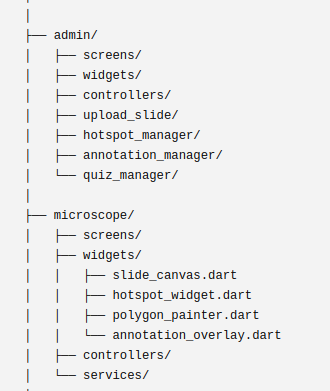
  <br>
  <em>Virtual Microscope module</em>
</p>

### Hotspot Module

The Hotspot Module enables educators to place interactive markers on important specimen regions. Each hotspot contains a title, description, and notes displayed when selected by a student.

<p align="center">
  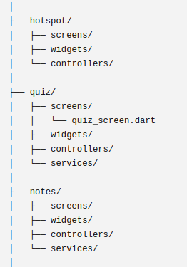
  <br>
  <em>Hotspot module</em>
</p>

### Annotation Module

The Annotation Module allows administrators to create, edit, resize, reposition, duplicate, and delete visual annotations. Annotation data is synchronized through Cloud Firestore.

<p align="center">
  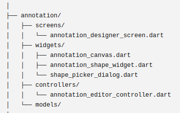
  <br>
  <em>Annotation module skeleton</em>
</p>

### Polygon Annotation Module

The Polygon Annotation Module extends the annotation system by supporting free-form polygon creation for irregular specimen regions. Administrators can define multiple vertices to accurately outline complex biological structures.

### Quiz Module

The Quiz Module provides formative assessments linked directly to microscope slides. Quiz content is retrieved dynamically from Cloud Firestore, scores are calculated automatically, and progress is stored for monitoring.

<p align="center">
  
  <br>
  <em>Quiz module</em>
</p>

### Notes Module

The Notes Module allows students to create, edit, organize, and delete personal study notes. Notes may be associated with a microscope slide or created using custom topics, and they are stored locally using SharedPreferences.

<p align="center">
  
  <br>
  <em>Notes module</em>
</p>

### Offline Learning Module

The Offline Learning Module allows students to download microscope slides and educational resources for offline use.

<p align="center">
  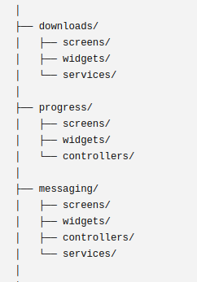
  <br>
  <em>Offline learning module</em>
</p>

### Admin Module

The Admin Module provides secure content management for microscope slides, hotspots, annotations, quizzes, specimen information, messages, and bulletins.

<p align="center">
  
  <br>
  <em>Admin module</em>
</p>

### Messaging Module

The Messaging Module supports communication between students and instructors. It provides a platform for announcements, academic guidance, responses to student questions, and bulletin updates.

<p align="center">
  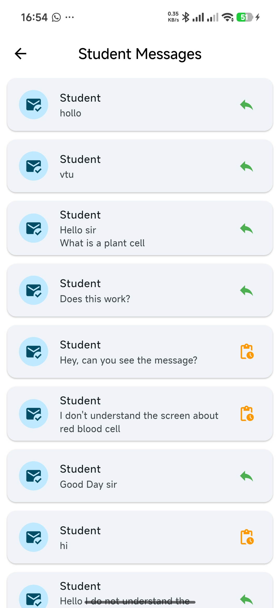
  <br>
  <em>Student messaging screen</em>
</p>

<p align="center">
  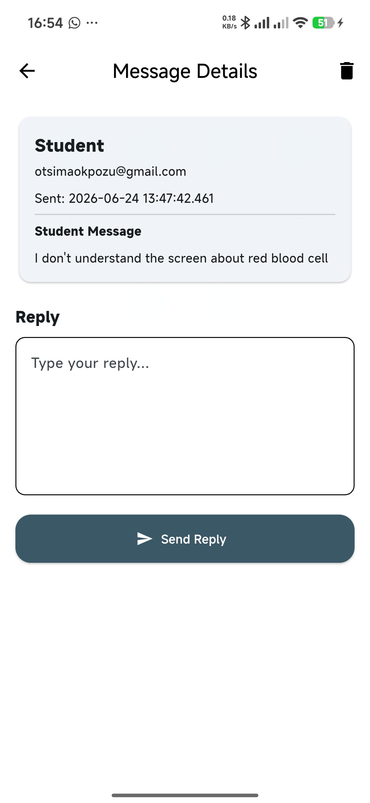
  <br>
  <em>Admin messaging screen</em>
</p>

### AI Learning Module

The AI Learning Module is a future enhancement. It is expected to provide intelligent tutoring, automated explanations of biological structures, personalized learning recommendations, and conversational support based on microscope observations.

## Achievements

The project successfully achieved its primary objectives by developing a comprehensive mobile virtual learning platform for microscopy education.

Major accomplishments include:

- Authentication system
- Virtual microscope viewer
- Interactive hotspots
- Annotation system
- Polygon annotations
- Quiz integration
- Offline slide support
- Firebase integration
- Modular architecture
- Student-to-instructor messaging and replies
- Instructor bulletins for students
- Cloudinary integration

Together, these components provide an engaging, scalable, and feature-rich educational environment for students and instructors.

## Lessons Learned

The development process strengthened practical experience in:

- Flutter state management
- Firebase integration
- Firestore database design
- Mobile application development
- Offline-first application concepts
- Educational software design
- Interactive image annotation techniques
- Git version control workflows
- Building scalable and maintainable cross-platform applications

## Challenges Faced

<p align="center">
  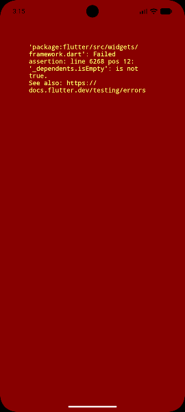
  <br>
  <em>Runtime issue encountered during development</em>
</p>

- Preventing runtime issues such as duplicate GlobalKeys, widget lifecycle errors, and state synchronization problems.
- Resolving Gradle, Android SDK, and Firebase initialization issues during project setup.
- Designing and implementing an interactive virtual microscope with smooth zooming and panning.
- Developing a robust annotation system that supports shape placement, editing, resizing, movement, and polygon annotations.
- Debugging Firestore data type mismatches and serialization/deserialization errors between Flutter models and cloud data.
- Implementing offline learning support while maintaining consistency between locally cached and cloud-based resources.
- Linking quizzes dynamically to microscope slides and resolving Firestore document retrieval and query challenges, especially NoSQL document IDs for quiz storage and retrieval.
- Managing application state efficiently across multiple modules.
- Managing GitHub workflows, including branch management, commits, merges, conflict resolution, and version consistency.
- Configuring and integrating Firebase Authentication, Cloud Firestore, and Cloudinary.
- Integrating authentication, microscope, hotspots, annotations, quizzes, messaging, and offline learning into one cohesive application.

## Future Enhancements

Planned future enhancements include AI-assisted, collaborative, and analytics-driven learning features.

### AI Capabilities

- Automated specimen identification
- Intelligent tutoring
- Context-aware explanations
- Adaptive learning pathways based on student progress and performance

### Collaboration Features

- Shared annotations
- Live classroom sessions
- Virtual practical demonstrations
- Teacher feedback tools

### Analytics and Real-Time Learning

- Learning progress tracking
- Performance analytics
- Student engagement metrics
- Real-time annotation updates
- Collaborative microscope sessions
- Classroom synchronization

## Scalability Considerations

The application is designed with future expansion in mind. Planned improvements include:

- Fine-grained role-based access control
- Multi-school deployment with data isolation
- A dedicated content management dashboard
- More robust cloud storage architecture
- Advanced caching mechanisms
- Performance improvements for large slide collections
- Reliability improvements for high-resolution image delivery

## Conclusion

The Virtual Learning Platform provides a mobile-based alternative to conventional microscopy practical sessions by integrating virtual microscope slides, interactive annotations, hotspots, quizzes, offline learning, messaging, and cloud-based content management into a single application.

Built with Flutter, Firebase, and Cloudinary, the system offers an engaging and accessible learning experience for students while providing administrators with efficient tools for managing educational content. It also establishes a strong foundation for future enhancements such as AI-assisted learning, collaborative classroom features, and advanced learning analytics.

## Appendix: Project Structure

```text
virtual_learning/
├── android/
├── ios/
├── linux/
├── macos/
├── web/
├── windows/
├── test/
├── assets/
│   ├── images/
│   ├── icons/
│   ├── animations/
│   ├── slides/
│   └── fonts/
├── lib/
│   ├── main.dart
│   ├── app.dart
│   ├── firebase_options.dart
│   ├── core/
│   │   ├── constants/
│   │   ├── services/
│   │   │   ├── auth_service.dart
│   │   │   ├── firestore_service.dart
│   │   │   ├── storage_service.dart
│   │   │   ├── cloudinary_service.dart
│   │   │   ├── download_service.dart
│   │   │   ├── progress_service.dart
│   │   │   └── note_service.dart
│   │   ├── theme/
│   │   ├── utils/
│   │   │   ├── validators.dart
│   │   │   ├── helpers.dart
│   │   │   └── extensions.dart
│   │   └── routes/
│   ├── data/
│   │   ├── models/
│   │   │   ├── user_model.dart
│   │   │   ├── slide_model.dart
│   │   │   ├── hotspot_model.dart
│   │   │   ├── annotation_model.dart
│   │   │   ├── annotation_shape.dart
│   │   │   ├── quiz_model.dart
│   │   │   ├── question_model.dart
│   │   │   ├── progress_model.dart
│   │   │   ├── note_model.dart
│   │   │   └── message_model.dart
│   │   ├── repositories/
│   │   │   ├── auth_repository.dart
│   │   │   ├── slide_repository.dart
│   │   │   ├── hotspot_repository.dart
│   │   │   ├── annotation_repository.dart
│   │   │   ├── quiz_repository.dart
│   │   │   ├── progress_repository.dart
│   │   │   ├── notes_repository.dart
│   │   │   └── message_repository.dart
│   │   └── providers/
│   ├── features/
│   │   ├── auth/
│   │   │   ├── screens/
│   │   │   ├── widgets/
│   │   │   ├── controllers/
│   │   │   └── services/
│   │   ├── dashboard/
│   │   │   ├── screens/
│   │   │   ├── widgets/
│   │   │   └── controllers/
│   │   ├── admin/
│   │   │   ├── screens/
│   │   │   ├── widgets/
│   │   │   ├── controllers/
│   │   │   ├── upload_slide/
│   │   │   ├── hotspot_manager/
│   │   │   ├── annotation_manager/
│   │   │   └── quiz_manager/
│   │   ├── microscope/
│   │   │   ├── screens/
│   │   │   ├── widgets/
│   │   │   │   ├── slide_canvas.dart
│   │   │   │   ├── hotspot_widget.dart
│   │   │   │   ├── polygon_painter.dart
│   │   │   │   └── annotation_overlay.dart
│   │   │   ├── controllers/
│   │   │   └── services/
│   │   ├── annotation/
│   │   │   ├── screens/
│   │   │   │   └── annotation_designer_screen.dart
│   │   │   ├── widgets/
│   │   │   │   ├── annotation_canvas.dart
│   │   │   │   ├── annotation_shape_widget.dart
│   │   │   │   └── shape_picker_dialog.dart
│   │   │   ├── controllers/
│   │   │   │   └── annotation_editor_controller.dart
│   │   │   └── models/
│   │   ├── hotspot/
│   │   │   ├── screens/
│   │   │   ├── widgets/
│   │   │   └── controllers/
│   │   ├── quiz/
│   │   │   ├── screens/
│   │   │   │   └── quiz_screen.dart
│   │   │   ├── widgets/
│   │   │   ├── controllers/
│   │   │   └── services/
│   │   ├── notes/
│   │   │   ├── screens/
│   │   │   ├── widgets/
│   │   │   ├── controllers/
│   │   │   └── services/
│   │   ├── downloads/
│   │   │   ├── screens/
│   │   │   ├── widgets/
│   │   │   └── services/
│   │   ├── progress/
│   │   │   ├── screens/
│   │   │   ├── widgets/
│   │   │   └── controllers/
│   │   ├── messaging/
│   │   │   ├── screens/
│   │   │   ├── widgets/
│   │   │   ├── controllers/
│   │   │   └── services/
│   │   └── ai/
│   │       ├── screens/
│   │       ├── widgets/
│   │       ├── services/
│   │       └── models/
│   ├── widgets/
│   │   ├── animated_character.dart
│   │   ├── loading_indicator.dart
│   │   ├── custom_button.dart
│   │   ├── custom_textfield.dart
│   │   ├── custom_dialog.dart
│   │   ├── app_drawer.dart
│   │   ├── empty_state.dart
│   │   └── error_widget.dart
│   └── generated/
├── firebase.json
├── firestore.rules
├── firestore.indexes.json
├── pubspec.yaml
├── analysis_options.yaml
├── README.md
└── LICENSE
```
